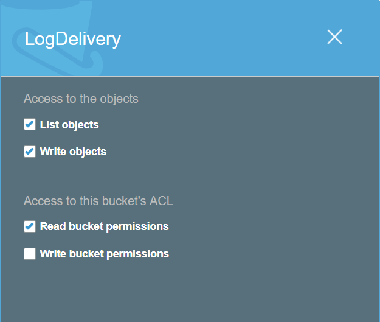
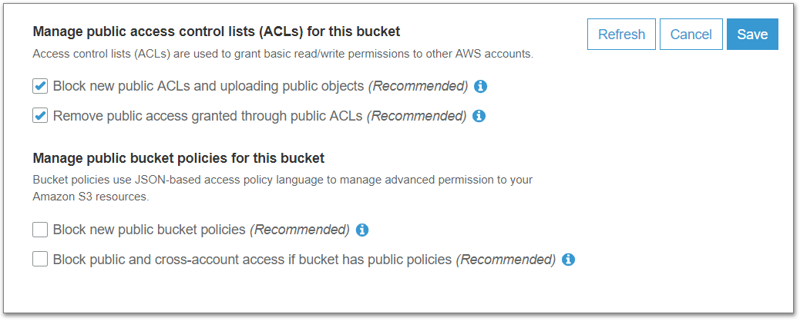

Title: Wyam Blog Setup
Published: 2019-04-18
Lead: How I set up my static Wyam blog
Tags:
    - Wyam
    - Amazon Web Services
---
I feel it is only fitting, as the first post of my blog, to describe how I set it up. I hope this will help others while
serving as maintenance documentation for myself.

I wanted a blog that is simple to use. I've tried several times before to start a blog, but I always fell into the trap
of biting off more than I could chew. I would choose a CMS, **Django** with **Mezzanine** at one point, **Orchard Core** for another, and go through
the process of setting up a linux instance in **Amazon Web Services**, getting all the required packages installed, getting
**Postgre** installed, configure the CMS, try to learn how to customize it while building up my design skills, figuring out how
to serve it with **NGINX**, etc. ad nauseam. My original goal was not only to blog about my experiences, but develop the knowledge and
skills to transition into a freelance career.

Needless to say, this never happened. It was always too many things to attempt to learn at once.

That brings me to this blog attempt. My goals for this attempt are much more limited and play to my strengths. I decided
I wanted "the simplest thing possible", and what can be more simple than just serving up static HTML? As I am a .Net
developer, I wanted something using .Net Core to take advantage of my current environment. After a very brief search I
stumbled upon Wyam. What immediately attracted my eye is that it can be very easily installed using the `dotnet` command line tool.
Additionally, and this is not a
feature exclusive to Wyam, there is no backend to worry about. No operating system to configure, patch, maintain, or backup. No
concerns about losing my content to an unfamiliar database. All my content lives in markdown files, and everything lives
in source control on GitHub. An AWS CodePipeline gets triggered by changes in the source tree, builds the site, and deploys the
static files to an AWS S3 Bucket where my DNS service provider directs requests.

# Registering a Domain Name

The first thing we need for a blog is a domain name. I just happen to have **benniecopeland.com** handy to use. It is registered
with NoIP, a dynamic DNS service provider that I have used for many years.

# Amazon S3 Buckets

Next we need a place to store and serve up static content. For this I chose an AWS S3 Bucket as I already have an account
with Amazon. They have extensive documentation for their services, including how to [host a static website on Amazon S3](https://docs.aws.amazon.com/AmazonS3/latest/dev/WebsiteHosting.html).
I won't rehash their entire documentation, but I will highlight a few points.

## S3 Bucket for logging

An S3 Bucket for web traffic logging is not required, but is useful for analytics. If you are going to use logging
then I recommend creating this first. In my case the bucket name is `logs.benniecopeland.com` mirroring the guidance from the
AWS [documentation](https://docs.aws.amazon.com/AmazonS3/latest/dev/LoggingWebsiteTraffic.html) on configuring logging.
What the documentation does not mention is that during the bucket creation you should grant the Amazon S3 Log Delivery
Group write access to the bucket during the **Set permissions** step. This can also be set after the bucket has been
created by going to **Permissions > Access Control List** tab on the Bucket and giving the *S3 log delivery group* the following
permissions.

{width=400px}

A final note for logging is that the logs do not show up immediately in the S3 Bucket, but are added [periodically](https://docs.aws.amazon.com/AmazonS3/latest/dev/ServerLogs.html#how-logs-delivered).

## S3 Bucket Name for content

The S3 Bucket name must match the planned domain name in order for S3 to be able to serve the content. This is because S3 uses
the request's `host` header to identify which Bucket contains the content as outlined in their virtual hosting
[documentation](https://docs.aws.amazon.com/AmazonS3/latest/dev/VirtualHosting.html#VirtualHostingCustomURLs).
In my case the bucket name follows my planned domain name of `www.benniecopeland.com`.

## Bucket Permissions

Before you can set the Bucket Policy and have your content be accessible, you have to change the **Public Access** settings. S3 is
very restrictive in its default configuration and prevents public access to the Bucket's content. Public access is exactly
what we want however to serve up our static content. The **Public Access** settings can be changed when
creating the bucket, or after creation under the **Permissions** tab. The two options under **Manage public bucket policies
for this bucket** must be unchecked.

{width=600px}

* The first option prevents you from assigning any policy, like the one outlined in AWS static hosting
[documentation](https://docs.aws.amazon.com/AmazonS3/latest/dev/WebsiteAccessPermissionsReqd.html), that allows public
access to the Bucket's content.
* The second option prevents the public access policy from actually being enforced as an additional safety measure.

With the policy in place as described by the static hosting
[documentation](https://docs.aws.amazon.com/AmazonS3/latest/dev/WebsiteAccessPermissionsReqd.html),
there is no need to set the ACL's for the files uploaded to the Bucket.

# DNS CNAME

# Deployment setup

AWS CodePipeline
AWS CodeBuild Create project

buildspec.yml

Log to S3 build/

Ubuntu
.NET Core Runtime
Use latest image

Create log bucket first